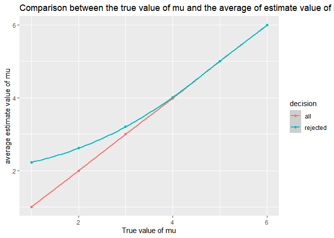

Homework 5
================
Na Yun Cho

``` r
library(tidyverse)
```

    ## -- Attaching packages --------------------------------------------------------------------------------- tidyverse 1.3.0 --

    ## v ggplot2 3.3.2     v purrr   0.3.4
    ## v tibble  3.0.3     v dplyr   1.0.2
    ## v tidyr   1.1.2     v stringr 1.4.0
    ## v readr   1.3.1     v forcats 0.5.0

    ## -- Conflicts ------------------------------------------------------------------------------------ tidyverse_conflicts() --
    ## x dplyr::filter() masks stats::filter()
    ## x dplyr::lag()    masks stats::lag()

# Problem 2

``` r
df = tibble(files = list.files(path = "./data", full.names = TRUE)) %>%
  mutate(file_contents = map(.x = files, ~read_csv(.x))) %>%
  unnest(file_contents) %>%
  pivot_longer(
    week_1 : week_8,
    names_to = "week",
    names_prefix = "week_",
    values_to = "observations"
  ) %>%
  mutate(files = str_replace(files, ".csv$", "")) %>%
  mutate(files = str_replace(files, "exp", "experimental"),
         files = str_replace(files, "con", "control")) %>%
  separate(files, into = c("arms_old", "id"), sep = "\\_") %>%
  separate(arms_old, into = c("dot", "data", "arm"), sep = "/") %>%
  select(arm, id, week, observations) %>%
  mutate(arm = as.factor(arm), id = as.numeric(id), week = as.numeric(week))
```

    ## Parsed with column specification:
    ## cols(
    ##   week_1 = col_double(),
    ##   week_2 = col_double(),
    ##   week_3 = col_double(),
    ##   week_4 = col_double(),
    ##   week_5 = col_double(),
    ##   week_6 = col_double(),
    ##   week_7 = col_double(),
    ##   week_8 = col_double()
    ## )
    ## Parsed with column specification:
    ## cols(
    ##   week_1 = col_double(),
    ##   week_2 = col_double(),
    ##   week_3 = col_double(),
    ##   week_4 = col_double(),
    ##   week_5 = col_double(),
    ##   week_6 = col_double(),
    ##   week_7 = col_double(),
    ##   week_8 = col_double()
    ## )
    ## Parsed with column specification:
    ## cols(
    ##   week_1 = col_double(),
    ##   week_2 = col_double(),
    ##   week_3 = col_double(),
    ##   week_4 = col_double(),
    ##   week_5 = col_double(),
    ##   week_6 = col_double(),
    ##   week_7 = col_double(),
    ##   week_8 = col_double()
    ## )
    ## Parsed with column specification:
    ## cols(
    ##   week_1 = col_double(),
    ##   week_2 = col_double(),
    ##   week_3 = col_double(),
    ##   week_4 = col_double(),
    ##   week_5 = col_double(),
    ##   week_6 = col_double(),
    ##   week_7 = col_double(),
    ##   week_8 = col_double()
    ## )
    ## Parsed with column specification:
    ## cols(
    ##   week_1 = col_double(),
    ##   week_2 = col_double(),
    ##   week_3 = col_double(),
    ##   week_4 = col_double(),
    ##   week_5 = col_double(),
    ##   week_6 = col_double(),
    ##   week_7 = col_double(),
    ##   week_8 = col_double()
    ## )
    ## Parsed with column specification:
    ## cols(
    ##   week_1 = col_double(),
    ##   week_2 = col_double(),
    ##   week_3 = col_double(),
    ##   week_4 = col_double(),
    ##   week_5 = col_double(),
    ##   week_6 = col_double(),
    ##   week_7 = col_double(),
    ##   week_8 = col_double()
    ## )
    ## Parsed with column specification:
    ## cols(
    ##   week_1 = col_double(),
    ##   week_2 = col_double(),
    ##   week_3 = col_double(),
    ##   week_4 = col_double(),
    ##   week_5 = col_double(),
    ##   week_6 = col_double(),
    ##   week_7 = col_double(),
    ##   week_8 = col_double()
    ## )
    ## Parsed with column specification:
    ## cols(
    ##   week_1 = col_double(),
    ##   week_2 = col_double(),
    ##   week_3 = col_double(),
    ##   week_4 = col_double(),
    ##   week_5 = col_double(),
    ##   week_6 = col_double(),
    ##   week_7 = col_double(),
    ##   week_8 = col_double()
    ## )
    ## Parsed with column specification:
    ## cols(
    ##   week_1 = col_double(),
    ##   week_2 = col_double(),
    ##   week_3 = col_double(),
    ##   week_4 = col_double(),
    ##   week_5 = col_double(),
    ##   week_6 = col_double(),
    ##   week_7 = col_double(),
    ##   week_8 = col_double()
    ## )
    ## Parsed with column specification:
    ## cols(
    ##   week_1 = col_double(),
    ##   week_2 = col_double(),
    ##   week_3 = col_double(),
    ##   week_4 = col_double(),
    ##   week_5 = col_double(),
    ##   week_6 = col_double(),
    ##   week_7 = col_double(),
    ##   week_8 = col_double()
    ## )
    ## Parsed with column specification:
    ## cols(
    ##   week_1 = col_double(),
    ##   week_2 = col_double(),
    ##   week_3 = col_double(),
    ##   week_4 = col_double(),
    ##   week_5 = col_double(),
    ##   week_6 = col_double(),
    ##   week_7 = col_double(),
    ##   week_8 = col_double()
    ## )
    ## Parsed with column specification:
    ## cols(
    ##   week_1 = col_double(),
    ##   week_2 = col_double(),
    ##   week_3 = col_double(),
    ##   week_4 = col_double(),
    ##   week_5 = col_double(),
    ##   week_6 = col_double(),
    ##   week_7 = col_double(),
    ##   week_8 = col_double()
    ## )
    ## Parsed with column specification:
    ## cols(
    ##   week_1 = col_double(),
    ##   week_2 = col_double(),
    ##   week_3 = col_double(),
    ##   week_4 = col_double(),
    ##   week_5 = col_double(),
    ##   week_6 = col_double(),
    ##   week_7 = col_double(),
    ##   week_8 = col_double()
    ## )
    ## Parsed with column specification:
    ## cols(
    ##   week_1 = col_double(),
    ##   week_2 = col_double(),
    ##   week_3 = col_double(),
    ##   week_4 = col_double(),
    ##   week_5 = col_double(),
    ##   week_6 = col_double(),
    ##   week_7 = col_double(),
    ##   week_8 = col_double()
    ## )
    ## Parsed with column specification:
    ## cols(
    ##   week_1 = col_double(),
    ##   week_2 = col_double(),
    ##   week_3 = col_double(),
    ##   week_4 = col_double(),
    ##   week_5 = col_double(),
    ##   week_6 = col_double(),
    ##   week_7 = col_double(),
    ##   week_8 = col_double()
    ## )
    ## Parsed with column specification:
    ## cols(
    ##   week_1 = col_double(),
    ##   week_2 = col_double(),
    ##   week_3 = col_double(),
    ##   week_4 = col_double(),
    ##   week_5 = col_double(),
    ##   week_6 = col_double(),
    ##   week_7 = col_double(),
    ##   week_8 = col_double()
    ## )
    ## Parsed with column specification:
    ## cols(
    ##   week_1 = col_double(),
    ##   week_2 = col_double(),
    ##   week_3 = col_double(),
    ##   week_4 = col_double(),
    ##   week_5 = col_double(),
    ##   week_6 = col_double(),
    ##   week_7 = col_double(),
    ##   week_8 = col_double()
    ## )
    ## Parsed with column specification:
    ## cols(
    ##   week_1 = col_double(),
    ##   week_2 = col_double(),
    ##   week_3 = col_double(),
    ##   week_4 = col_double(),
    ##   week_5 = col_double(),
    ##   week_6 = col_double(),
    ##   week_7 = col_double(),
    ##   week_8 = col_double()
    ## )
    ## Parsed with column specification:
    ## cols(
    ##   week_1 = col_double(),
    ##   week_2 = col_double(),
    ##   week_3 = col_double(),
    ##   week_4 = col_double(),
    ##   week_5 = col_double(),
    ##   week_6 = col_double(),
    ##   week_7 = col_double(),
    ##   week_8 = col_double()
    ## )
    ## Parsed with column specification:
    ## cols(
    ##   week_1 = col_double(),
    ##   week_2 = col_double(),
    ##   week_3 = col_double(),
    ##   week_4 = col_double(),
    ##   week_5 = col_double(),
    ##   week_6 = col_double(),
    ##   week_7 = col_double(),
    ##   week_8 = col_double()
    ## )

``` r
df
```

    ## # A tibble: 160 x 4
    ##    arm        id  week observations
    ##    <fct>   <dbl> <dbl>        <dbl>
    ##  1 control     1     1         0.2 
    ##  2 control     1     2        -1.31
    ##  3 control     1     3         0.66
    ##  4 control     1     4         1.96
    ##  5 control     1     5         0.23
    ##  6 control     1     6         1.09
    ##  7 control     1     7         0.05
    ##  8 control     1     8         1.94
    ##  9 control     2     1         1.13
    ## 10 control     2     2        -0.88
    ## # ... with 150 more rows

``` r
plot = df %>%
  ggplot(aes(x = week, y = observations, group = interaction(id, arm), color = arm)) +
  geom_line() + labs(title = "Observations on each subject in experimental and control arms", x = "week", y = "observations")

plot
```

<!-- -->

# Problem 3

### Create a function

``` r
sim_ttest = function(mu) {
  
  sim_data = tibble(
    x = rnorm(n = 30, mean = mu, sd = 5)
  )
  
  sim_data %>%
    t.test(mu = 0, alternative = "two.sided", conf.level = 0.95) %>%
    broom::tidy() %>%
    select(estimate, p.value)
}

sim_ttest(0)
```

    ## # A tibble: 1 x 2
    ##   estimate p.value
    ##      <dbl>   <dbl>
    ## 1   -0.902   0.334

### Simulations 5000 times for mu = 0

``` r
sim_mu0 = rerun(5000, sim_ttest(0)) %>%
  bind_rows()
```

### Simulations 5000 times for mu = 1,2,3,4,5,6

``` r
sim_mus = tibble(mu = c(1,2,3,4,5,6)) %>%
  mutate( 
    output = map(.x = mu, ~rerun(5000, sim_ttest(.x))), 
    estimate= map(output, bind_rows)) %>%
  select(mu, estimate) %>%
  unnest(estimate)
```

### Make plots

##### (1) step 1 of making plot 1

``` r
test_power = 
  sim_mus %>%
  mutate(decision = case_when(
    p.value < 0.05 ~ "rejected", 
    p.value >= 0.05 ~ "fail to reject"
  )) %>%
  group_by(mu) %>%
  summarize(
    total_decision = n(), 
    total_reject = sum(decision == "rejected")
  ) %>%
  mutate(
    prop_tests = map2(.x = total_reject, .y = total_decision, ~prop.test(x = .x, n = .y)), 
    tidy_tests = map(.x = prop_tests, ~broom::tidy(.x))
  ) %>%
  select(mu, total_decision, total_reject, tidy_tests) %>%
  unnest(tidy_tests) %>%
  select(mu, estimate, conf.low, conf.high) %>%
  rename(power = estimate)
```

    ## `summarise()` ungrouping output (override with `.groups` argument)

``` r
test_power
```

    ## # A tibble: 6 x 4
    ##      mu power conf.low conf.high
    ##   <dbl> <dbl>    <dbl>     <dbl>
    ## 1     1 0.184    0.173     0.195
    ## 2     2 0.572    0.558     0.586
    ## 3     3 0.889    0.880     0.897
    ## 4     4 0.989    0.985     0.991
    ## 5     5 1        0.999     1    
    ## 6     6 1        0.999     1

##### (2) step 2 of making plot 1

``` r
test_power %>% ggplot(aes(x = mu, y = power)) +
  geom_point() +
  geom_smooth() + 
  labs(title = "Association between Effect Size and Power", x = "true value of mu", y ="power")
```

    ## `geom_smooth()` using method = 'loess' and formula 'y ~ x'

    ## Warning in simpleLoess(y, x, w, span, degree = degree, parametric =
    ## parametric, : Chernobyl! trL>n 6
    
    ## Warning in simpleLoess(y, x, w, span, degree = degree, parametric =
    ## parametric, : Chernobyl! trL>n 6

    ## Warning in sqrt(sum.squares/one.delta): NaNs produced

    ## Warning in stats::qt(level/2 + 0.5, pred$df): NaNs produced

    ## Warning in max(ids, na.rm = TRUE): no non-missing arguments to max; returning -
    ## Inf

<!-- -->
Comment : The plot shows that greater the effect size, greater the power
of a test. As the effect size increases from 1 to 6, the power of the
test increases as well. When the effect size is around 4, the power of
the test also reaches its maximum value of 1 and plataeus there.

##### (3) step 1 of making plot 2

``` r
all_null = sim_mus %>%
  group_by(mu) %>%
  summarize(
    all = mean(estimate)
  )
```

    ## `summarise()` ungrouping output (override with `.groups` argument)

``` r
rejected_null = sim_mus %>%
  mutate(decision = case_when(
    p.value < 0.05 ~ "rejected", 
    p.value >= 0.95 ~ "fail to reject"
  )) %>%
  filter(decision == "rejected") %>%
  group_by(mu) %>%
  summarize(
    rejected = mean(estimate)
  )
```

    ## `summarise()` ungrouping output (override with `.groups` argument)

##### (4) step 2 of making plot 2

``` r
plot_2 = 
  left_join(all_null, rejected_null, by = "mu") %>%
  pivot_longer(
    all:rejected, 
    names_to = "types", 
    values_to = "average_mu_estimate"
  ) %>%
  ggplot(aes(x = mu, y = average_mu_estimate, color = types)) + 
  geom_point() +
  geom_smooth() +
  labs(title = "Comparison between the true value of mu and the average of estimate value of mu", x = "True value of mu", y = "average estimate value of mu")

plot_2
```

    ## `geom_smooth()` using method = 'loess' and formula 'y ~ x'

    ## Warning in simpleLoess(y, x, w, span, degree = degree, parametric =
    ## parametric, : Chernobyl! trL>n 6
    
    ## Warning in simpleLoess(y, x, w, span, degree = degree, parametric =
    ## parametric, : Chernobyl! trL>n 6

    ## Warning in sqrt(sum.squares/one.delta): NaNs produced

    ## Warning in stats::qt(level/2 + 0.5, pred$df): NaNs produced

    ## Warning in simpleLoess(y, x, w, span, degree = degree, parametric =
    ## parametric, : Chernobyl! trL>n 6
    
    ## Warning in simpleLoess(y, x, w, span, degree = degree, parametric =
    ## parametric, : Chernobyl! trL>n 6

    ## Warning in sqrt(sum.squares/one.delta): NaNs produced

    ## Warning in stats::qt(level/2 + 0.5, pred$df): NaNs produced

    ## Warning in max(ids, na.rm = TRUE): no non-missing arguments to max; returning -
    ## Inf
    
    ## Warning in max(ids, na.rm = TRUE): no non-missing arguments to max; returning -
    ## Inf

<!-- -->
Comment: The sample average of mu across tests for which the null is
rejected is greater than the true value of mu until the true value of mu
reached 4. This makes sense because as the effect size increases, the
power of the test increases as well, and when the effect size is around
4, the power of the test also reaches its maximum value of 1.
